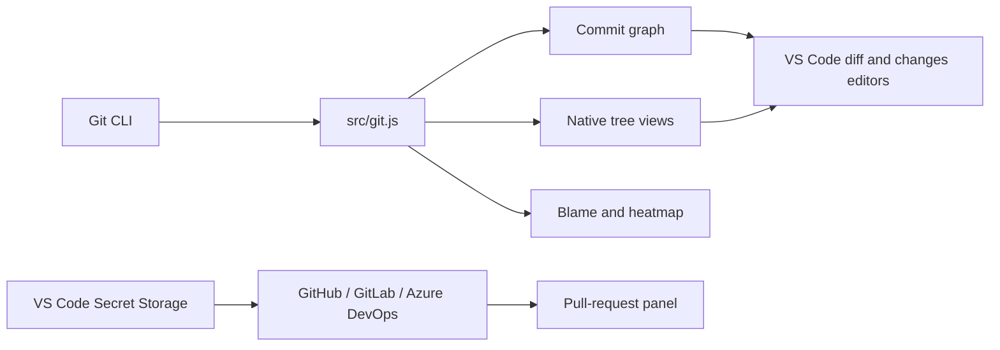

# GitTree


GitTree is a Git-focused VS Code extension with a colorful commit graph, native changed-file trees, branch and commit workflows, blame tools, worktree/submodule management, and pull-request support for GitHub, GitLab, and Azure DevOps.

It talks directly to the Git CLI and does not replace VS Code's built-in Source Control provider.

For short, task-focused instructions, see the [GitTree User Guide](docs/USER_GUIDE.md). Installed users can run **Open User Guide** or select the book icon in GitTree.

## Highlights

- Colorful commit graph with branch lanes, merge nodes, tags, remotes, signature indicators, search, and current/all-ref scopes.
- Native Changes view with the active VS Code file-icon theme, folder hierarchy, Git status colors, and stage/unstage/discard operations.
- Branches view grouped by slash-delimited prefixes, with expandable commit history and ahead/behind tracking.
- Commit and branch comparison, including Ctrl/Cmd multi-selection and comparisons against working changes.
- Native VS Code multi-file changes editor for reviewing a commit or comparison.
- Inline blame and an age-based, full-file blame heatmap.
- Stashes, tags, worktrees, submodules, rebase, interactive rebase, signed commits, and file history.
- Pull-request details, files, tasks, threaded Markdown comments, code context, and comment counts inside VS Code.
- GitHub, GitLab, and configurable Azure DevOps repository support.
- Automatic light/dark theme adaptation through VS Code theme variables.

## Requirements

- VS Code `1.90.0` or newer.
- Git available on `PATH`.
- An open workspace contained in a Git repository.
- A trusted, filesystem-backed workspace.
- Network access and authentication when loading private pull requests.

GitTree supports multi-root workspaces. When several repositories are detected, it asks which repository to use and retains that selection while it remains available.

GitTree is a workspace extension. In WSL, SSH, Dev Containers, or Codespaces, install it in the remote workspace when VS Code prompts. GitTree cannot run in the Web Worker extension host because it requires Node.js and the Git CLI.

## Getting started

1. Install GitTree and open a folder inside a Git repository.
2. Select the GitTree icon in the Activity Bar.
3. Use **Changes** for working-tree files and commits.
4. Use **Branches** to browse branches and their recent commits.
5. Run **Show Commit Graph** or press `Ctrl+Alt+G` (`Cmd+Alt+G` on macOS) for the full graph.
6. Select files to open native VS Code diffs; use context menus for Git actions.

The status-bar branch item also opens the commit graph.

## Commit graph

The graph renders commits and merge topology using colored SVG lanes. It includes:

- Local branches, remote branches, tags, and HEAD labels.
- Ellipsis for long reference labels, with the complete name available on hover.
- Valid/problematic commit-signature indicators.
- A working-tree pseudo commit when uncommitted changes exist.
- Search by commit message, author, or SHA.
- All-refs and current-branch scopes.
- Fetch, pull, push, stash, and refresh actions.
- List/tree changed-file layouts, filtering, and file statistics in the details workflow.
- Theme-aware comparison highlighting for source and target rows.

### Graph interaction

- Click a commit to select it and inspect its information.
- Ctrl/Cmd-click another commit to compare the two revisions.
- Right-click commits or reference labels for Git actions.
- Use **Open Changes** to open all changed files in VS Code's native multi-file changes editor.
- Click an individual changed file to open its native side-by-side diff.

### Commit actions

- Open changes or reveal the commit in the graph.
- Select for comparison or compare with a previously selected revision.
- Checkout in detached mode.
- Cherry-pick or revert.
- Create a branch or tag at the commit.
- Interactive rebase and reset workflows from the graph.
- Copy the full commit ID or commit message.

### Branch actions

- Switch, fetch, pull, or push a branch.
- Merge into the current branch or rebase the current branch onto it.
- Start an interactive rebase.
- Open branch changes in the native multi-file changes editor.
- Compare with working changes or another selected branch/commit.
- Create a pull request or a tag at the branch.
- Open the branch on its remote provider.
- Rename, delete, or copy the branch name.

Potentially destructive actions request confirmation.

## GitTree views

### Commit

Enter a commit message and run a normal, amended, or signed commit workflow. Amend without a new message uses Git's existing commit message.

### Changes

The native changed-files tree provides:

- Staged and unstaged files.
- Folder-tree and flat-list modes.
- Sorting by path, filename, or status.
- VS Code file-theme icons and Git decoration colors.
- Added, modified, deleted, renamed, conflicted, and untracked states.
- Stage, unstage, stage-all, unstage-all, and confirmed discard.
- Open file, reveal in Explorer, copy path, and copy relative path.
- Native side-by-side diffs.
- Advanced stash options for tracked, untracked, staged-only, and keep-index changes.

The Changes view badge reports the repository's changed-file count.

### Branches

- Local and remote groups.
- Prefix grouping such as `feature/account/login`.
- Expandable recent commit history.
- Current branch, upstream, pushed/unpushed, signature, and relative-time information.
- Ahead, behind, and diverged branch colors.
- Commit and branch hover details.
- Ctrl/Cmd selection of two branches/commits, including mixed commit-to-branch comparison.
- Author filtering and remote URL management.

### Stashes and tags

- Create, inspect, apply, pop, and delete stashes.
- Create, checkout, compare, and delete tags.

### Worktrees and submodules

- Add, open, lock, unlock, remove, and prune worktrees.
- Open submodules and initialize/update or synchronize them recursively.

### Pull Requests

GitTree detects GitHub, GitLab, and Azure DevOps remotes. The Pull Requests view lists requests created by the authenticated user and highlights the request related to the current branch.

Opening a pull request inside VS Code shows:

- Title, description, author, source/target branches, state, and web link.
- Linked tasks or work items when supplied by the provider.
- A separate **Files changed** tab with A/M/D/R states and addition/deletion counts.
- Native side-by-side file diffs.
- Markdown-rendered conversation and review comments.
- Threaded replies, with code context attached only to the root code comment.
- Active/total comment counts where provider data is available.

Provider APIs can restrict comment or file endpoints. GitTree treats optional GitHub comment failures as non-fatal and reports partial-data warnings in the PR view.

## Authentication and hosting providers

### GitHub

GitTree uses VS Code's GitHub authentication session when available. Ensure VS Code is signed into the GitHub account that can access the repository. A `403` can indicate missing repository scope, organization SSO authorization, or API rate limiting; a `404` for a private repository usually indicates that the active session cannot access it.

### GitLab

Run **Set GitLab Token Securely…** and enter a personal access token. The token is stored in VS Code Secret Storage, not in workspace settings.

### Azure DevOps

Configure the repository using either one full URL or split settings. Then run **Set Azure DevOps Token Securely…** and enter an active PAT.

Recommended full URL:

```json
{
  "gitTree.azureDevOps.repositoryUrl": "https://dev.azure.com/my-organization/my-project/_git/my-repository"
}
```

Split configuration:

```json
{
  "gitTree.azureDevOps.endpoint": "https://dev.azure.com",
  "gitTree.azureDevOps.organization": "my-organization",
  "gitTree.azureDevOps.project": "my-project",
  "gitTree.azureDevOps.repository": "my-repository"
}
```

Azure DevOps Server and `visualstudio.com` collection URLs are also supported. The full repository URL takes precedence over the split fields.

PAT values cannot be viewed again in Azure DevOps after creation. If the value was not saved, regenerate or create a replacement token, then update GitTree's Secret Storage entry.

## Blame and history

- **Toggle Inline Blame** adds author, relative date, summary, and commit ID to the active line.
- **Toggle Full-file Blame Heatmap** colors lines and the overview ruler by commit age.
- **File History** is available from editor and Explorer context menus and follows file renames.

## Settings

| Setting | Default | Description |
| --- | ---: | --- |
| `gitTree.maxCommits` | `500` | Maximum commits loaded into the graph. |
| `gitTree.showRemoteBranches` | `true` | Include remote branches in the graph. |
| `gitTree.blame.enabled` | `true` | Enable inline blame for the active line. |
| `gitTree.dateFormat` | `relative` | Display `relative` or `absolute` graph dates. |
| `gitTree.azureDevOps.repositoryUrl` | empty | Full Azure DevOps repository URL; overrides split settings. |
| `gitTree.azureDevOps.endpoint` | empty | Azure DevOps cloud/server endpoint or collection URL. |
| `gitTree.azureDevOps.organization` | empty | Organization when it is not already part of the endpoint. |
| `gitTree.azureDevOps.project` | empty | Project name. |
| `gitTree.azureDevOps.repository` | empty | Repository name or ID. |

## How the pieces fit together



GitTree does not contribute a separate SCM provider to VS Code's built-in Source Control panel. Its Changes tree lives only in the GitTree Activity Bar container.

## Development

Clone/open the repository and press `F5` to launch an Extension Development Host using [.vscode/launch.json](.vscode/launch.json).

Useful commands:

```bash
node test/run-tests.js
node test/run-tests.js --syntax-only
node test/run-tests.js --unit-only
npx @vscode/vsce package
```

Equivalent npm scripts are available:

```bash
npm test
npm run test:syntax
npm run test:unit
npm run package
```

The automated suite validates JavaScript syntax, the extension manifest, command registrations, menu references, view/settings contributions, Git parsers, and core feature surfaces.

The workspace also includes tasks for validation, packaging, local VSIX installation, and Marketplace publishing. In the Extension Development Host, press `Ctrl+R` to reload code changes. Contribution changes in `package.json` still require an extension-host reload because VS Code reads them during initialization.

## Project layout

| Path | Purpose |
| --- | --- |
| `src/extension.js` | Activation, commands, providers, repository discovery, and refresh wiring. |
| `src/git.js` | Dependency-free Git CLI wrapper and parsers. |
| `src/graphPanel.js` | Commit-graph webview host and native diff integration. |
| `src/views.js` | Branch, change, stash, tag, worktree, submodule, and PR tree providers. |
| `src/actions.js` | Shared Git workflows, prompts, progress, and confirmations. |
| `src/blame.js` | Inline blame and heatmap behavior. |
| `src/prPanel.js` | GitHub/GitLab/Azure pull-request detail panel. |
| `media/` | Graph scripts and theme-aware styles. |
| `resources/` | Extension and README artwork. |
| `test/` | Automated validation runner. |

## Known limitations

- Git must be installed locally; GitTree does not include an embedded Git implementation.
- Provider API permissions determine which PR comments, work items, and file details are available.
- The active VS Code file-icon theme is available in native tree/diff views, but arbitrary graph webview HTML cannot directly consume that theme's private icon assets.
- Reloading the Extension Development Host is required after changes to contributed commands, views, menus, or settings.

## License

[MIT](LICENSE)
